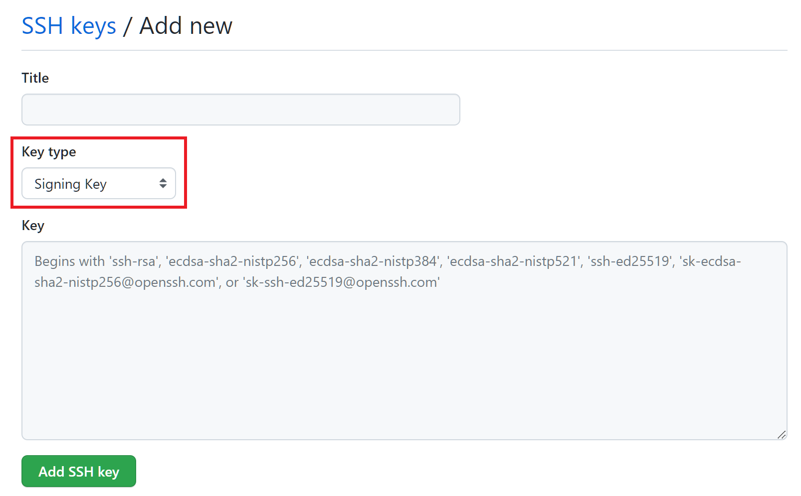
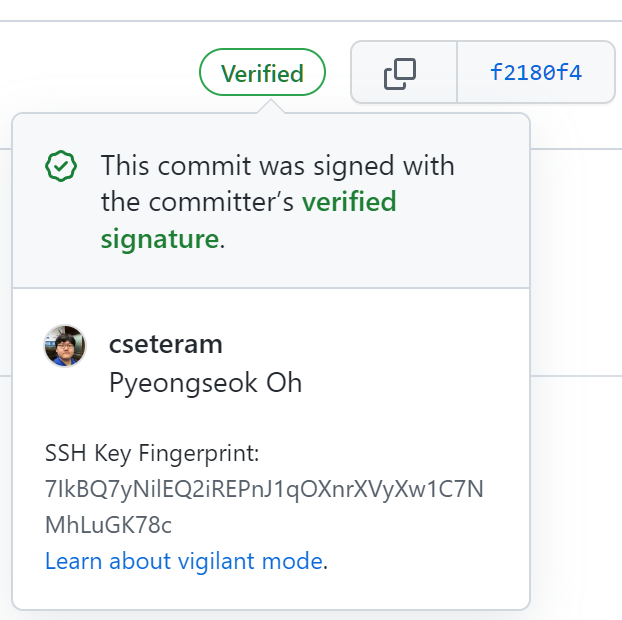

## 배경

Git에서는 [커밋 시 서명][git-commit-signing]을 하는 기능이 있습니다.

```
git commit -S
```

이렇게 서명을 한 후 GitHub에 푸시를 하면, 커밋에 **Verified** 라벨이 붙습니다.
이는 GitHub이 서명을 검증하는 데 성공한 것으로, 다른 사람들은 이를 보고 실제로 저자가 이 커밋을 하였는지 확인할 수 있게 됩니다.

기존에는 GPG 키를 이용하여 커밋 서명을 할 수 있었는데,  GPG 키를 사용하고 관리하는 것은 매우 까다로운 일입니다.
이에 대한 대안으로 [Git 2.34][git-2-34] 버전부터는 SSH 키를 이용하여 커밋에 서명을 할 수 있습니다만...
GitHub에서는 이를 지원하지 않아 SSH 키로 서명을 하면 **Unverified** 상태로 표시되었습니다.


하지만 이제 GitHub에서도 [SSH 커밋 검증을 지원][github-support-ssh-signing]합니다. :tada:

[git-commit-signing]: https://git-scm.com/book/en/v2/Git-Tools-Signing-Your-Work
[git-2-34]: https://github.blog/2021-11-15-highlights-from-git-2-34/#tidbits
[github-support-ssh-signing]: https://github.blog/changelog/2022-08-23-ssh-commit-verification-now-supported/

## 세팅법

### SSH 키 준비

우선 서명에 사용할 SSH 공개 키가 필요합니다.
이는 다음과 같이 확인합니다.

```
$ ls ~/.ssh | grep '.*\.pub'
id_ed25519.pub
```

만약 키가 없다면 `ssh-keygen -t ed25519` 와 같이 입력하여 새로운 키를 생성할 수 있습니다.
```
$ ssh-keygen -t ed25519
Generating public/private ed25519 key pair.
Enter file in which to save the key (/home/user/.ssh/id_ed25519):
Enter passphrase (empty for no passphrase):
Enter same passphrase again:
```

### Git 세팅

다음과 같이 Git에서 커밋 시 SSH 키를 사용하도록 설정합니다.
여기서는 `~/.ssh/id_ed25519.pub` 키를 등록하였습니다.

```
git config gpg.format ssh
git config user.signingKey "~/.ssh/id_ed25519.pub"
git config commit.gpgsign true
```

### GitHub에 SSH 키 등록

이제 GitHub에 접속한 후 서명에 사용할 SSH 공개 키를 등록하면 됩니다.

계정 설정에서 SSH and GPG keys > New SSH key 메뉴에 들어가 등록합니다.
이 때 등록하는 키는 Key type을 Signing Key로 설정하여야 합니다.



여기까지 진행하면 이제 GitHub이 서명에 사용한 SSH 키를 검증한 후, 성공하면 **Verified** 라벨을 붙여주게 됩니다.

## 테스트

커밋 서명 및 검증이 잘 동작하는 지 확인하기 위해
[테스트용 리포지토리][test-github-ssh-signing]를 생성한 후 커밋 및 푸시를 하였습니다.



위 그림과 같이 **Verified** 태그가 잘 붙어 있는 것을 확인할 수 있습니다. :+1:

[test-github-ssh-signing]: https://github.com/cseteram/github-ssh-signing
